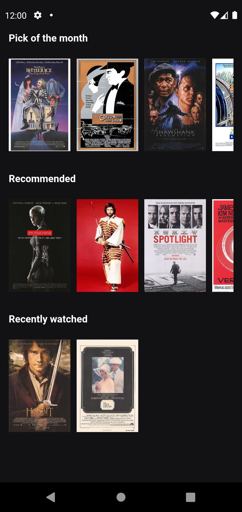
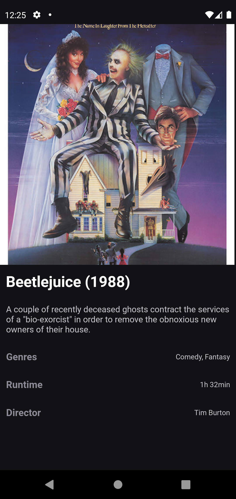

# challenge-24i

## How to run this project

In the project directory, you can run:

### `Yarn`

yarn && yarn start

### `Npm`

npm install && npm start

- Download the Expo go App and scan the QR code displayed in the terminal.
- Install an android emulator and follow the steps in the terminal.

## Libraries used
  - Expo
  - Styled components

## Assumptions

### Home Page

This page is just the entry point, basically the user can see the movie list and 
navigate to the movie detail that it was selected.

### Movie Detail

In this page the user can see the details that belong to the movie selected.

# TODO

 - Make the app responsive to other devices
 - Develop unity tests.
